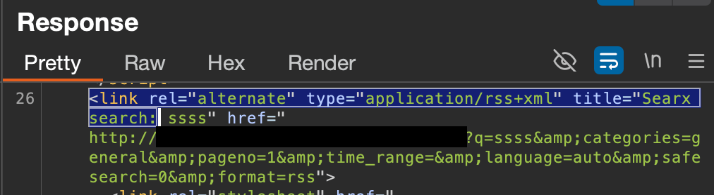

- *Inspired by the following article *(applies to OpenBSD)*: [Be your own privacy respecting (meta)search engine with SearXNG!](https://マリウス.com/be-your-own-privacy-respecting-google-bing-brave/)*

Recently, I stumbled across the above article detailing how to set up and configure the Metasearch Engine [SearXNG](https://docs.searxng.org/#), a choice & [privacy-focused](https://docs.searxng.org/own-instance.html#how-does-searxng-protect-privacy) alternative to singular, centralised major search engines like Google or Bing. 

SearXNG does not actually perform the actual **indexing** of results, but instead looks up and aggregates results from 240+ search services (which can be as heavily or as lightly configured as you wish). So the actual work is done by the search engines themselves, and SearXNG provides a highly customisable way to:
1. **Aggregate results from a wide (or narrow - up to you!) range of sources**, after 
2. **Applying custom prioritisation and removal rules** that (importantly) **you** configure; tailoring results to how **you'd *actually*** like them.

**In short, it puts more control back in *your* hands, should you choose to configure it.** Or, even at its sensible defaults, it aggregates results from a wider range of sources, and removes a sole reliance on one given party to decide what you can and can't see on the internet. 

Which, either way, are **MASSIVE selling points** to me, especially in the age of AI-slop search results and a general downtrend on both the quality and accuracy of online information. 

Should I end up liking and regularly using this tool, expect to see some follow-up post(s) on configuring sources and search order prioritisation within SearXNG.

But for now, this post will primarily detail **how to get your own instance of SearXNG to a working state**, in which it's able to be **self-hosted** and **accessed remotely** from behind a (primarily already pre-configured) `NGINX` reverse proxy. This means you'll be able to access it (with `BASIC` auth... not ideal, but better than nothing) on the go, to incorporate it on your mobile devices and access it remotely (unless you choose to restrict it to internal network IPs only, or don't expose it publicly at all - totally up to you!). 

Alternatively, this could be changed to be remotely accessible [behind a VPN like Tailscale](https://www.youtube.com/watch?v=cg9d87PuanE), as the linked video goes into (SearXNG + Proxmox Cluster + Tailscale).

I hadn't come across an existing detailed tutorial (with a *very* precursory search) for **setting SearXNG up as a custom TrueNAS Scale `YAML`-based app behind `NGINX` reverse proxy**, so I thought I'd do a little writeup on how I managed it.

---
# Folder structure in TrueNAS:
``` bash
/mnt/my-ssd/configs/searxng
├── .env   # Docker env variables (SEARXNG_HOSTNAME, LETSENCRYPT_EMAIL)
├── redis-data/     # Persistent Valkey/Redis data (in a dump.rdb file)
├── searxng-data/   # SearXNG cache (search results, images)
└── searxng-main/   # Main SearXNG config folder
    ├── limiter.toml   # Limiter configuration for public instances
    └── settings.yml   # Main SearXNG config (engines, privacy, UI, server)
```
(I set up `redis-data/, searxng-data/, searxng-main/` as Datasets for the `Apps` user in the TrueNAS webUI, and manually `ssh`'d in to the TruenNAS shell to create the `.env` and `limiter.toml` files, to mirror what was outlined in the [searxng-docker](https://github.com/searxng/searxng-docker?tab=readme-ov-file) install).

---
# `docker-compose.yaml` file for custom TrueNAS app:

*(replace `[YOUR-TRUENAS-IP]:[XXXX]` with your own internal IP for your TrueNAS instance and a free port. For instance, `172.16.0.130:5060`)*

``` YAML
networks:
  searxng: Null
services:
  redis:
    command: valkey-server --save 30 1 --loglevel warning
    container_name: redis
    image: docker.io/valkey/valkey:8-alpine
    logging:
      driver: json-file
      options:
        max-file: '1'
        max-size: 1m
    networks:
      - searxng
    restart: unless-stopped
    volumes:
      - /mnt/my-ssd/configs/searxng/redis-data:/data
  searxng:
    container_name: searxng
    environment:
      - SEARXNG_BASE_URL=http://[YOUR-TRUENAS-IP]:[XXXX]
    image: docker.io/searxng/searxng:latest
    logging:
      driver: json-file
      options:
        max-file: '1'
        max-size: 1m
    networks:
      - searxng
    ports:
      - '[XXXX]:8080'
    restart: unless-stopped
    volumes:
      - /mnt/my-ssd/configs/searxng/searxng-main:/etc/searxng:rw
      - /mnt/my-ssd/configs/searxng/searxng-data:/var/cache/searxng:rw
volumes:
  redis-data: Null
  searxng-data: Null
```


*If considering hosting it publicly (i.e. behind NGINX), you want to make sure to:*
- set `limiter: true`, `public_instance: true`, `url: valkey://redis:6379/0` in `settings.yaml` (shown below)
- set `link_token = true` in `limiter.toml` (shown below)
- consider **==additional security measures & configurations==** to harden the instance, such as:
	- Securing access to the web UI behind authentication (NGINX has `BASIC` auth configurable via the web UI, which is better than *nothing*, but not state-based & thus not ideal in the long run. Could be swapped for a stronger supported authentication method)
	- changing `environment: SEARXNG_BASE_URL=` in `docker-compose.yaml` to your domain name to avoid leaking your internal IP and port you're hosting this on within the body of the searches (also just a little cleaner)
	  

---
# `limiter.toml`:
```bash
# This configuration file updates the default configuration file
# See https://github.com/searxng/searxng/blob/master/searx/limiter.toml

[botdetection.ip_limit]
# activate advanced bot protection
# enable this when running the instance for a public usage on the internet
link_token = true
```

---
# `settings.yaml` (only containing the settings changed from the default file generated upon initial app creation in TrueNAS):
*Make sure to replace `secret_key=` with a random, 64-character generated key, using something like a password manager or `openssl rand hex 64`, for example.*
``` bash
search:
  autocomplete: "duckduckgo"

server:
  # Is overwritten by ${SEARXNG_PORT} and ${SEARXNG_BIND_ADDRESS}
  port: 8888
  bind_address: "127.0.0.1"
  # public URL of the instance, to ensure correct inbound links. Is overwritten
  # by ${SEARXNG_BASE_URL}.
  base_url: false  # "http://example.com/location"
  # rate limit the number of request on the instance, block some bots.
  limiter: true
  # enable features designed only for public instances.
  public_instance: true

  secret_key: "64-CHAR-SECRETKEY"
  image_proxy: true
  http_protocol_version: "1.1"
  method: "POST"
  default_http_headers:
    X-Content-Type-Options: nosniff
    X-Download-Options: noopen
    X-Robots-Tag: noindex, nofollow
    Referrer-Policy: no-referrer

valkey:
  # URL to connect valkey database. Is overwritten by ${SEARXNG_VALKEY_URL}. See https://docs.searxng.org/admin/settings/settings_valkey.html#settings-valkey
  url: valkey://redis:6379/0
```

---
#### `.env` file: 
*(replace `[YOUR-TRUENAS-IP]:[XXXX]` with your own internal IP for your TrueNAS instance and the free port you used for SearXNG. For instance, `172.16.0.130:5060`. Also, your own Let's Encrypt email, if using one with NGINX)*
``` bash
# By default listen on https://localhost
# To change this:
# * uncomment SEARXNG_HOSTNAME, and replace <host> by the SearXNG hostname
# * uncomment LETSENCRYPT_EMAIL, and replace <email> by your email (require to create a Let's Encrypt certificate)
SEARXNG_HOSTNAME=http://[YOUR-TRUENAS-IP]:[XXXX]
LETSENCRYPT_EMAIL=myemail@email.com
```

---
# NGINX Proxy Config - for self-hosting it remotely (without VPN):

***Note:** the below assumes you've already configured your NGINX reverse proxy to manage the self hosting of (potentially multiple other) internal apps, like a Jellyfin or Subsonic instance. Plenty of tutorials exist online about how to do this, so it will be omitted for brevity*

1. Create a **new Proxy Host** in `NGINX` reverse proxy manager. 
   
   *Make sure to replace the IP & port with those set in the files above, i.e. your own internal IP for your TrueNAS instance and the free port you used for SearXNG. For instance, `172.16.0.130:5060`. Also, replace the Domain Name with a subdomain configured in NGINX that your own and wish to access SearXNG from.*
   
   

2. Configure authenticated access (especially if hosting publicly). 
   
   *Create an **Access List** and apply it to the proxy entry, so users have to authenticate when accessing SearXNG at your proxy's publicly hosted domain. Additionally, **restrict access to specific internal IPs** if using strictly in your home network (e.g. your home network/specific VLANs).* 
   
   *Seems to use `BASIC` auth by default, which isn't **great**, but better than nothing.*

---
### Additional helpful resources:
- [searxng-docker](https://github.com/searxng/searxng-docker?tab=readme-ov-file)
- [Private Internet Searches with SearXNG](https://www.youtube.com/watch?v=SlqGDoXPazY)
- [Step by step installation (SearXNG docs)](https://docs.searxng.org/admin/installation-searxng.html)
- [SearXNG behind Tailscale](https://www.youtube.com/watch?v=cg9d87PuanE)