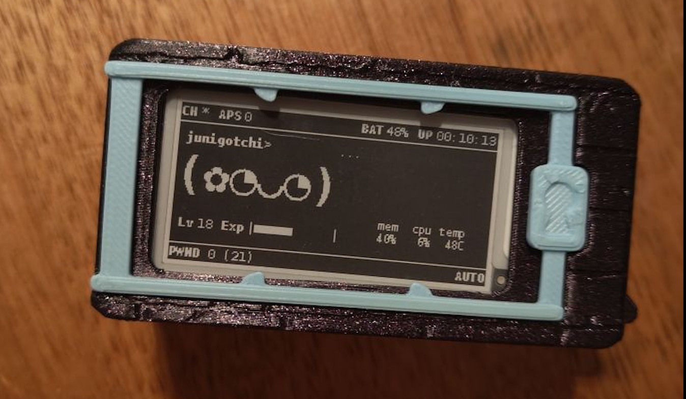

has ***this*** ever happened to ***you?***


have your parents, who you still live with due to you being (a) the resident tech support terrified of the idea of becoming **remote** tech support and (b) crippled by the shithole that is the housing market where you live, persistently refused your pleas for a pet, despite your begging and pleading and promises of "*i'll get my mental health together and manage to keep myself out of hospital if i only had a furry friend to cuddle up with when things get rough?*"
...no? just me?

well, in that case... have you ever wanted your own lil digital pet... **who can also sniff, eat and munch down on nearby wireless communication handshakes and signals?**

of course you do! so, **meet the irreverent `pwnagotchi`!**



...and it's lack of fur is a compromise that I am willing to make (one which can even be rectified when it comes to 3D-printing your pet a case, but I'm not going that far... *yet*. I'll keep working on my parents for a while longer, first.)

---

# why a pwnagotchi?
... well, why not? it's an adorable lil wifi pwning guy that just wants to munch on wireless handshakes that it sniffs on your travels together, and save them for... *later analsyis* (AKA, fun with hashcat - article coming soon!).

but for those who want a more practical summary: its a tool that, as you venture the world, will use several techniques (de-authentication frames sent to devices connected to Wireless Access Points, association frames sent *to* WAPs, and passive handshake collection) to capture handshakes sent between devices and wireless access points. in doing so, it can amass valuable information about the security of the wifi networks themselves, and potentially enough to reconstruct hashes of the passwords for said networks (alongside lots of other useful data). a full breakdown on what exactly is captured will be given later on in the series, but there's an interesting article on the two kinds of "captures" performed: `WPA*01` **([PMKID](https://blog.geekinstitute.org/2025/05/wifi-security-analysis-pmkid-attack-method-and-hash-cracking.html#technical-background) capture)** & `WPA*02` **(full 4-way handshake capture** that i found [here](https://www.evilsocket.net/2019/02/13/Pwning-WiFi-networks-with-bettercap-and-the-PMKID-client-less-attack/) that's worth a read.

oh, and aside from sniffing packets & reconstruction hashes of wireless network passwords as you go about your day?

> "to give hackers an excuse to learn about reinforcement learning and WiFi networking—and have a reason to get out for more walks." ([ref~](https://pwnagotchi.ai/))

---

## what is a pwnagotchi "image"
the pwnagotchi "images" themselves are just a custom set of programs built on top of Raspberry Pi OS, which itself is a debian-based linux operating system. the pwnagotchi image leverages tools designed for interacting with wireless signals—like `bettercap`, `libpcap` and `aircrack-ng`—and can be built from source and tweaked if desired ([detailed here](https://github.com/jayofelony/pwnagotchi/wiki/Step-1-Installation-for-other-boards)). the image is pre-bundled to be flashed to the SD card inserted into the raspberry pi by a tool like [Raspberry Pi Imager](https://www.raspberrypi.com/software/), or [Balena Etcher](https://etcher.balena.io/).

---
#### clarification on the various images/wikis etc.
now this can be an area of confusion, so i'll provide a bit of background on the various guides/wikis/images that exist within the pwnagotchi project-sphere. 

since the pwnagotchi project has been around for a good long while now, with maintainers of images & wikis coming and going, there have been various forks created as both the hardware (from Rasp. Pi Zero to Zero 2W) and software itself has evolved.

it all began with the original [evilsocket pwnagotchi repo](https://github.com/evilsocket/pwnagotchi), which **hasn't been updated since 2021**. it still works from what i've heard, but some have reported various problems with either the image itself, the AI ML mode, as well as getting custom plugins to run & supporting newer hardware like the Raspberry Pi Zero 2 W. 

for those reasons, more up-to-date guides scattered across the internet recommend the fork of this project by [jayofelony](https://github.com/jayofelony/pwnagotchi/), which is much more regularly maintained and still responsive to issues/PRs, and has support for a plethora of user-created plugins (with the ability to write your own as single `.py` files fairly easily, which I plan to do soon!). as i always try and look for a well-maintained and healthy community when choosing a project to both use and support, **i went with this one.**

there are also alternative forks out there to consider, including [AluminiumIce](https://github.com/aluminum-ice/pwnagotchi/) (which has support for turning it into a [FancyGotchi](https://github.com/V0r-T3x/fancygotchi)) and [DrSchottky](https://github.com/DrSchottky/pwnagotchi), but these are either not as well-documented/maintained or for different use cases to mine (e.g. FancyGotchi customisations & theme manager). definitely check out the projects and show them some love for their hard work, **but do a search of the pros/cons for using their images if you do decide on those routes.**

# in terms of the various wikis & guides...
- **[pwnagotchi.ai](https://pwnagotchi.ai/)** --> the original wiki, based almost entirely off the original [evilsocket pwnagotchi repo](https://github.com/evilsocket/pwnagotchi). still contains useful stuff, but may be outdated/inconsistent for the jayofelony image i'm using.
- **[pwnagotchi.org](https://pwnagotchi.org/)** --> a slightly more updated wiki, [recommending](https://pwnagotchi.org/3rd-party-images/index.html) and based on [jayofelony's pwnagotchi image](https://github.com/jayofelony/pwnagotchi/) to use for install, as well as mentioning the original evilsocket repo & alternatives like iceman. contains useful info to take the build further, as well as extra bits and pieces.
- ==**[jayofelony's wiki](https://github.com/jayofelony/pwnagotchi/wiki)**== --> the most up-to-date install guide for the image i'm using, **so see this as the bible for this project**, supported by [pwnagotchi.org](https://pwnagotchi.org/) for finding extensions & plugins.

# the TLDR - what wiki and image i used:
**pwnagotchi image:** [jayofelony's pwnagotchi image](https://github.com/jayofelony/pwnagotchi/releases)

**install guide/steps:** this article!, alongside **[jayofelony's wiki.](https://github.com/jayofelony/pwnagotchi/wiki)**

---
# steps to adopting your own pwnagotchi

whilst this can technically be made on any mini-computer that has a suitable wireless interface card, i'm going the classic Raspberry Pi Zero 2W route, for its [various hardware capability improvements](https://beebom.com/raspberry-pi-zero-2-w-vs-raspberry-pi-zero-w/) over the Pi Zero W. however, the older model is still definitely capable, but **you will need the 32-bit release if using the Zero W**. [32-bit OS's will also work on the Pi Zero 2W](https://medium.com/@techhara/stick-with-32-bit-os-for-raspberry-pi-zero-2w-d5367ce5a6d4), but it *does* support 64-bit, and it ultimately what i went for.
- a detailed comparison on the performance differences between 32/64-bit systems on the Pi Zero 2W [is available here](https://docs.printercow.com/guide/32bit-vs-64bit.html), and worth a read if interested. 
## base components i used:

| **Component**                                                                                                                                          | Price (inc. shipping) |
| ------------------------------------------------------------------------------------------------------------------------------------------------------ | --------------------- |
| *The body:* [Raspberry Pi Zero 2 WH (pre-soldered headers)](https://www.pakronics.com.au/products/raspberry-pi-zero-2-wh-with-header-rpi-sc0721)`*`     | $41.57                |
| *The muscles:* [Pisugar S Portable 1200 mAh UPS](https://www.amazon.com.au/Portable-Pwnagotchi-Raspberry-Accessories-handhold/dp/B0CXX7X9X7)           | $58                   |
| *The energy stores:* [3.7V 2200mAh Polymer Lithium LiPo Rechargeable Battery 803160](https://www.aliexpress.com/item/1005005610005715.html)            | $13.60                |
| *The face:* [2.13 inch E-Ink 2-colour HAT (250x122 Pixels)](https://core-electronics.com.au/250x122-213inch-e-ink-display-hat-for-raspberry-pi-1.html) | $34.55                |
| *The brain:* MicroSD card - 32GB                                                                                                                       | $0 (pre-owned)        |
| **TOTAL**                                                                                                                                              | ~ $145.07AUD          |
# notes on the items above:
- `*` Now, **heavy** caveat with getting the Pi Zero 2 **WH (pre-soldered headers)**: the pins underneath the headers **were not long enough to make sufficient contact with the Pisugar S battery board, preventing it from providing power.** i consequently had to **add more solder** to the undersides of several of the header pins afterwards, which *seemed* to fix it but was far from ideal and temperamental at best, but at least it allows current to flow between the two for now. *(a precarious process when your soldering iron sucks and only the sides, not the tip, heat up properly, making precise alterations difficult)*.
- `*` I also clipped the tops of the pre-soldered headers with wire cutters to slim the pwnagotchi design, as when fully seated originally there was ~2mm of excess pin length which irritated me and bulked up the design.
- The PiSugar S Portable came with its own 1200mAh battery pre-soldered and attached via magnet. This is fine to use, but I unsoldered it to replace with the *very safe and legitimate* AliExpress battery that was both slimmer and had a larger capacity for more pwning potential during the day. 
- The e-ink hat comes with an extraneous white screen connector component that can be desoldered and removed to slim the case design. Ensure to wrap the exposed headers on the board underneath in some electrical tape or similar to avoid any short circuits!


### Repos:

**Current:**

**Tried:**
- [jayofelony 2.8.9](https://github.com/jayofelony/pwnagotchi/releases/tag/v2.8.9) (working)
- [evilsocket 1.5.5](https://github.com/evilsocket/pwnagotchi/releases) (not working)

### Guides:
- Setup steps: https://github.com/jayofelony/pwnagotchi/wiki/Step-2-Connecting
- https://biscuitshop.us/pages/pwnagotchi-basic-instructions
- [Setup: official guide (outdated in places)](https://pwnagotchi.ai/configuration/#select-your-display)

**Assembly/setup videos:**
- https://www.youtube.com/watch?v=7nj5Euo5Bng&list=PL2xB7IbHP_82xC931zH5iHIjLc50Q5-87&index=2
- [ANYONE Can Build A PWNagotchi! PWNing WiFi Has Never Been Easier!](https://www.youtube.com/watch?v=OFxKN3N4gE8)
- https://www.youtube.com/watch?v=2RwYQjZj1GU
- [DIY Pwnagotchi 2025: Full Build, Setup, and Configuration Guide](https://www.youtube.com/watch?v=NA289GGBszI)


#### Customisations:
 - [x] [girlagotchi](https://cyberspacemanmike.com/2023/10/14/dark-mode-girl-pwnagotchi-girlagotchi/)
 - [x] `config.toml` generator: https://pwnstore.org/pwnconfig.html
 - [ ]  [custom faces](https://www.youtube.com/watch?v=_N9trpMco4M) (+ drivers)
 - [ ] [custom plugins & bt-tethering](https://www.youtube.com/watch?v=hVsF-rUosek)
	 - [x] https://www.reddit.com/r/pwnagotchi/comments/1c2fjbz/how_to_setup_bttether_for_androidhow_to_get_the/ (tried & done)
- [ ] [pwnagotchi plugin spreadsheet](https://docs.google.com/spreadsheets/u/0/d/1os8TRM3Pc9Tpkqzwu548QsDFHNXGuRBiRDYEsF3-w_A/htmlview#gid=0)
- [ ] more pwnagotchi plugins ([pwnstore](https://pwnstore.org/index.html))

### various repos:
- [jayofelony](https://github.com/jayofelony/pwnagotchi/releases)
- [aluminium-ice](https://github.com/aluminum-ice/pwnagotchi)
- [og (evilsocket)](https://github.com/evilsocket/pwnagotchi/releases)
- 


### Cracking guides:
- https://dev.to/yegct/hashcat-cracking-pwnagotchi-pcap-files-4fh2
- [hashcat on mac](https://thetechfirmblog.blogspot.com/2024/11/a-beginners-guide-to-using-hashcat-on.html)
- https://eins.li/posts/wifi-hacking-pwnagotchi/
- ==TO READ: [Cracking WPA/WPA2 with hashcat](https://hashcat.net/wiki/doku.php?id=cracking_wpawpa2)==

Must first convert pcaps into hashcat compatible files, using something like [hcxpcapngtool](https://github.com/ZerBea/hcxtools). Can do this on the pwnagotchi itself if using the latest jayofelony image, as this tool suite comes pre-installed. Or, install `hcxtools` with package manager/brew (harder on windows... use the [online tool instead](https://hashcat.net/cap2hashcat/)). Alternatively, can use [hashieclean.py](https://github.com/arturandre/pwnagotchi-beacon-plugins/blob/main/hashieclean.py) as a custom pwnagotchi plugin to do this for every `pcap` captured.
- `hcxpcapngtool -o hashes.hc22000 ./handshakes/*.pcap`

To break down the hc22000 format itself:
``` bash
## WPA record type structure:
WPA*01*PMKID*MAC_AP*MAC_CLIENT*ESSID***MESSAGEPAIR
WPA*02*MIC*MAC_AP*MAC_CLIENT*ESSID*NONCE_AP*EAPOL_CLIENT*MESSAGEPAIR

## "real" sample data (example):
WPA*01*71c747849720d7562a37d3c83592b4e5*bc30d9ca770c*98d86363a3fa*54656c73747261434137373041***01
WPA*02*173bd2a4c9610f8d1c5ce6a0e67036ac*6ccdd6ca1479*0c96e6530da4*54656c7374726133334443*5ee489b7f45ff9f581e72223b2f7804148f79d68af618353e1c2780457be77e1*0103007502010a00000000000000000000ffcd845dad1302771b11249a330056c14e500ef1e5df8dde8f55b575f0319262000000000000000000000000000000000000000000000000000000000000000000000000000000000000000000000000001630140100000fac040100000fac040100000fac020c00*a2
```

---
##### Diving deeper into hc22000's WPA01 and WPA02 record types:

1. **WPA*01 — PMKID capture**
Format: `WPA*01 * PMKID * MAC_AP * MAC_CLIENT * ESSID ** MESSAGEPAIR`

- **WPA*01** — identifies this as a PMKID-type record
- **PMKID** — a 128-bit value the AP broadcasts, derived from the network password, AP MAC, and client MAC. Hashcat tries to recompute it from candidate passwords
- **MAC_AP** — the access point's MAC address (hex, no colons)
- **MAC_CLIENT** — the client device's MAC. Can be empty (shown as `**`) if no client was needed — which is the whole point of PMKID captures
- **ESSID** — the network name, hex-encoded
- **MESSAGEPAIR** — a flag byte. `01` means PMKID-only capture


2. **WPA*02 — MIC / full handshake capture**
Format: `WPA*02 * MIC * MAC_AP * MAC_CLIENT * ESSID * NONCE_AP * EAPOL_CLIENT * MESSAGEPAIR`

- **WPA*02** — identifies this as a MIC-based record (classic 4-way handshake)
- **MIC** — the Message Integrity Code, an HMAC value computed from the derived session key. Hashcat recomputes this for each candidate password and checks for a match
- **MAC_AP** — access point MAC
- **MAC_CLIENT** — client MAC
- **ESSID** — network name, hex-encoded
- **NONCE_AP** — a 32-byte random number the AP generated for this handshake session. Used in key derivation
- **EAPOL_CLIENT** — the raw EAPOL frame sent by the client. This is the largest field and is what the MIC is actually computed over
- **MESSAGEPAIR** — flag byte describing which handshake messages were captured. Common values:
    - `00` = messages M1+M2
    - `01` = PMKID only
    - `02` = M2+M3 (nonce from M2)
    - `a2` = M2+M3 (nonce from M3) — most reliable for cracking
    - `04` = M3+M4


**Other notes**
- The ESSID is hex-encoded because SSIDs can contain arbitrary bytes. Decode with: `echo "54656c737472614341373730" | xxd -r -p` --> `TelstraCA770%`
- A missing MAC_CLIENT (empty field) in a WPA*01 record is normal — PMKID captures don't require a client to be present
- The `a2` MESSAGEPAIR in the WPA*02 sample is a good result — it means a clean M2+M3 capture with the nonce sourced from the more reliable M3 frame

---

Once you've got your hc22000 file, need to install hashcat!

When installing hashcat on windows, I downloaded the latest release & created a `.bat` file in my `PATH` with the following content, so I could call it ***and*** all its dependencies from anywhere, as was unable to find `./OpenCL/shared.cl` otherwise: 

``` bash
@echo off
cd /d "C:\Users\junip\Documents\Scripts\hashcat-7.1.2"
hashcat.exe %*
```

Also as I was using a NVIDIA GPU, needed to install both the latest [NVIDIA drivers](https://www.nvidia.com/en-us/drivers/) (use NVIDIA app for ease of use) and the [CUDA toolkit](developer.nvidia.com/cuda-downloads) (see also [archived versions](https://developer.nvidia.com/cuda-toolkit-archive)). Ensure you're on the latest hashcat build, as can get errors about mismatched versions otherwise.

Also, when passing the parameters to the CLI, make sure to wrap **both in `""`** - as I was getting `Hash '.\candidates_fixed.hc22000': Separator unmatched - No hashes loaded.` error without it.

### Crafting an attack:

Here are some examples on the [hashcat WPA wiki page](https://hashcat.net/wiki/doku.php?id=cracking_wpawpa2&#attack_examples).
#### Straight cracking against a wordlist:
- ` hashcat -m 22000 "C:\Users\junip\Desktop\handshakes\combined\candidates.hc22000" "C:\Users\junip\Desktop\handshakes\dicts\dictionary_private.dic"`
#### Using a ruleset + a strong base wordlist
Combines a strong base wordlist (e.g. `rockyou` or one from above) with common permutations/rulesets (`best66` used here - **may want to develop a standard wifi password ruleset based on how people construct their passwords from base words**)
`hashcat -m 22000 "C:\Users\junip\Desktop\handshakes\combined\candidates.hc22000" "C:\Users\junip\Desktop\handshakes\dicts\rockyou.txt" -r "C:\Users\junip\Documents\Scripts\hashcat-7.1.2\rules\best66.rule"`
- Consider using a ruleset to [create more work for full speed](https://hashcat.net/wiki/doku.php?id=frequently_asked_questions#how_to_create_more_work_for_full_speed)

#### WPA1/WPA2 specific dictionaries/wordlists
- [Dictionaries from wpa-sec](https://wpa-sec.stanev.org/?dicts) cracking project (i used [C-nets](https://wpa-sec.stanev.org/dict/cracked.txt.gz))
- [rockyou.txt](https://weakpass.com/wordlists/rockyou.txt)
- [wpawifi wordlist](https://github.com/kennyn510/wpa2-wordlists)
- Weakpass - filter for WPA keys
	- https://weakpass.com/wordlists/weakpass_wifi_1
	- https://weakpass.com/wordlists/dictionary_private.dic
	- https://weakpass.com/wordlists/super_wpa
#### Resources on WPA1/WPA2 specific cracking techniques
- Target networks - and [use router keyspace wordlists!](https://github.com/3mrgnc3/RouterKeySpaceWordlists/blob/master/README.md)!
- [Thread on WPA-specific cracking](https://hashcat.net/forum/thread-4431.html)
- [Combining wordlists guide](https://eins.li/posts/make-your-own-wordlist/)
- [How cracking WPA2 is ... kinda hard](https://www.reddit.com/r/HowToHack/comments/d1v9k1/wpa_wpa_2_psk_best_practices_hashcat_or_aircrack/)

Some advice from [a wise redditor](https://www.reddit.com/r/pwnagotchi/comments/1cbamil/cracking_passwords/):
> For wordlists I use [wpawifi wordlist](https://github.com/kennyn510/wpa2-wordlists), allinone, rockyou refined down for wpa only, default wpa. Rules are either OneRuleToRuleThemAll, Best64 or no rule. You can find all kinds of helpful resources on github like these [lists](https://github.com/3mrgnc3/RouterKeySpaceWordlists/blob/master/README.md) showing the [default formats](https://github.com/sheimo/Wifi-WPA-Keyspace-List) of different [ISP/Router stock passwords](https://github.com/danielmiessler/SecLists/blob/master/.bin/README.md) to help refine an attack. You can often identify the ISP from the wifi name if its unchanged and you can ID the router brand often by looking at the packets in the pcap in wireshark. Others may have better suggestions here for wordlist/rules, i'm pretty new to hashcat myself still.

---
#### Cracking a "known" WPA01 PMKID - to test that your dictionary/ruleset is working:
To test, [use this python script](https://gist.github.com/fyxme/aad64a7c6f7552391e2930dd7bce668a) to **generate a hashcat compatible hash (type 22000) from a given WiFi SSID and password**. Select type `pmkid` to generate the WPA01 record type.

Input a known password from your dictionary wordlist you're testing against (e.g. `iloveyou` from the `rockyou.txt` file), and an arbitrary wifi SSID. 

``` bash
## generate hashcat compatible hash from SSID & password
> python .\hc_wifi_gen.py --ssid MyTestWifiNetwork --password iloveyou --type pmkid --output mytestwifi.hc22000
Hash saved to mytestwifi.hc22000
```
Then, supply the output `mytestwifi.hc22000` file to `hashcat` using the dictionary that includes the password you used (`iloveyou`):
``` bash
## cracking it!
> hashcat -m 22000 "C:\Users\junip\Desktop\handshakes\mytestwifi.hc22000" "C:\Users\junip\Desktop\handshakes\dicts\rockyou.txt"
hashcat (v7.1.2) starting

CUDA API (CUDA 13.2)
====================
* Device #01: NVIDIA GeForce RTX 2070 SUPER, 7131/8191 MB, 40MCU

OpenCL API (OpenCL 3.0 CUDA 13.2.51) - Platform #1 [NVIDIA Corporation]
=======================================================================
* Device #02: NVIDIA GeForce RTX 2070 SUPER, skipped

Minimum password length supported by kernel: 8
Maximum password length supported by kernel: 63
Minimum salt length supported by kernel: 0
Maximum salt length supported by kernel: 256

Hashes: 1 digests; 1 unique digests, 1 unique salts
Bitmaps: 16 bits, 65536 entries, 0x0000ffff mask, 262144 bytes, 5/13 rotates
Rules: 1

Optimizers applied:
* Zero-Byte
* Single-Hash
* Single-Salt
* Slow-Hash-SIMD-LOOP

Watchdog: Temperature abort trigger set to 90c

Host memory allocated for this attack: 2142 MB (18921 MB free)

Dictionary cache built:
* Filename..: C:\Users\junip\Desktop\handshakes\dicts\rockyou.txt
* Passwords.: 14344391
* Bytes.....: 139921497
* Keyspace..: 14344384
* Runtime...: 1 sec

ba85532f928852b68ecd76ba14553c2c:a38b5f42d67a:ef5ab3acd83c:MyTestWifiNetwork:iloveyou

Session..........: hashcat
Status...........: Cracked
Hash.Mode........: 22000 (WPA-PBKDF2-PMKID+EAPOL)
Hash.Target......: C:\Users\junip\Desktop\handshakes\mytestwifi.hc22000
Time.Started.....: Mon Apr 06 19:48:18 2026 (0 secs)
Time.Estimated...: Mon Apr 06 19:48:18 2026 (0 secs)
Kernel.Feature...: Pure Kernel (password length 8-63 bytes)
Guess.Base.......: File (C:\Users\junip\Desktop\handshakes\dicts\rockyou.txt)
Guess.Queue......: 1/1 (100.00%)
Speed.#01........:   507.4 kH/s (9.77ms) @ Accel:2 Loops:512 Thr:512 Vec:1
Recovered........: 1/1 (100.00%) Digests (total), 1/1 (100.00%) Digests (new)
Progress.........: 111883/14344384 (0.78%)
Rejected.........: 70923/111883 (63.39%)
Restore.Point....: 0/14344384 (0.00%)
Restore.Sub.#01..: Salt:0 Amplifier:0-1 Iteration:0-1
Candidate.Engine.: Device Generator
Candidates.#01...: 123456789 -> greenbean1
Hardware.Mon.#01.: Temp: 58c Fan:  0% Util: 53% Core:1905MHz Mem:7000MHz Bus:16

Started: Mon Apr 06 19:48:16 2026
Stopped: Mon Apr 06 19:48:20 2026
```


### Modified version of `hashieclean.py`
I also modified `hashieclean` with the help of claude to append the converted hashes into one file, like `pwncrack` does, so it can be grabbed and used with hashcat straight away (without combining the per-network files typically created by this plugin).

``` python
import logging
import io
import subprocess
import os
import json
import pwnagotchi.plugins as plugins
from threading import Lock
from pwnagotchi.ui.components import LabeledValue
from pwnagotchi.ui.view import BLACK
import pwnagotchi.ui.fonts as fonts

'''
hcxpcapngtool needed, to install:
> git clone https://github.com/ZerBea/hcxtools.git
> cd hcxtools
> apt-get install libcurl4-openssl-dev libssl-dev zlib1g-dev
> make
> sudo make install
'''


class hashieclean(plugins.Plugin):
    __author__ = 'Artur Oliveira'
    __version__ = '1.1.0'
    __license__ = 'GPL3'
    __description__ = '''

This version removes "lonely pcaps", those can't be converted
either to the formats .22000 (EAPOL) or .16800 (PMKID). As
the number of lonely pcaps increase the loading time increases
too. Besides that, the checking for completed handshakes
is done more efficiently, thus reducing even further 
the loading time of the plugin.

Additionally, all EAPOL hashes are appended to a single
combined.hc22000 file in the handshakes directory, deduplicated,
for easy use with hashcat.

Based on hashi by junohea.mail@gmail.com:

Attempt to automatically convert pcaps to a crackable format.
If successful, the files  containing the hashes will be saved 
in the same folder as the handshakes. 
The files are saved in their respective Hashcat format:
    - EAPOL hashes are saved as *.22000 (and combined.hc22000)
    - PMKID hashes are saved as *.16800
All PCAP files without enough information to create a hash are
    stored in a file that can be read by the webgpsmap plugin.

Why use it?:
    - Automatically convert handshakes to crackable formats! 
        We dont all upload our hashes online ;)
    - Repair PMKID handshakes that hcxpcapngtool misses
    - If running at time of handshake capture, on_handshake can
        be used to improve the chance of the repair succeeding
    - Be a completionist! Not enough packets captured to crack a network?
        This generates an output file for the webgpsmap plugin, use the
        location data to revisit networks you need more packets for!
    - All EAPOL hashes combined into a single combined.hc22000 file
        for easy hashcat cracking sessions
    
Additional information:
    - Currently requires hcxpcapngtool compiled and installed
    - Attempts to repair PMKID hashes when hcxpcapngtool cant find the SSID
    - hcxpcapngtool sometimes has trouble extracting the SSID, so we 
        use the raw 16800 output and attempt to retrieve the SSID via tcpdump
    - When access_point data is available (on_handshake), we leverage 
        the reported AP name and MAC to complete the hash
    - The repair is very basic and could certainly be improved!
Todo:
    Make it so users dont need hcxpcapngtool (unless it gets added to the base image)
        Phase 1: Extract/construct 22000/16800 hashes through tcpdump commands
        Phase 2: Extract/construct 22000/16800 hashes entirely in python
    Improve the code, a lot
                        '''
    
    def __init__(self):
        logging.info("[hashieclean] plugin loaded")
        self.lock = Lock()
        self.combined_file = None

    # called when everything is ready and the main loop is about to start
    def on_config_changed(self, config):
        handshake_dir = config['bettercap']['handshakes']
        self.combined_file = os.path.join(handshake_dir, 'combined.hc22000')
        
        if 'interval' not in self.options or not (self.status.newer_then_hours(self.options['interval'])):
            logging.info('[hashieclean] Starting batch conversion of pcap files')
            with self.lock:
                self._process_stale_pcaps(handshake_dir)
    
    def is22000(self, filename):
        fullpathNoExt = filename.split('.')[0]
        return os.path.isfile(fullpathNoExt +  '.22000')

    def is16800(self, filename):
        fullpathNoExt = filename.split('.')[0]
        return os.path.isfile(fullpathNoExt +  '.16800')

    def _load_existing_hashes(self):
        """Load existing hashes from the combined file into a set for dedup."""
        existing = set()
        if self.combined_file and os.path.isfile(self.combined_file):
            try:
                with open(self.combined_file, 'r') as f:
                    for line in f:
                        line = line.strip()
                        if line:
                            existing.add(line)
            except Exception as e:
                logging.error('[hashieclean] Could not read combined file: {}'.format(e))
        return existing

    def _append_to_combined(self, hashes):
        """Append a list of new (deduplicated) hash strings to the combined file."""
        if not self.combined_file:
            logging.warning('[hashieclean] combined_file path not set, skipping append')
            return 0
        try:
            existing = self._load_existing_hashes()
            new_hashes = [h for h in hashes if h and h not in existing]
            if new_hashes:
                with open(self.combined_file, 'a') as f:
                    for h in new_hashes:
                        f.write(h + '\n')
                logging.debug('[hashieclean] Appended {} new hashes to combined file'.format(len(new_hashes)))
            return len(new_hashes)
        except Exception as e:
            logging.error('[hashieclean] Could not append to combined file: {}'.format(e))
            return 0

    def on_handshake(self, agent, filename, access_point, client_station):
        with self.lock:
            handshake_status = []
            fullpathNoExt = filename.split('.')[0]
            name = filename.split('/')[-1:][0].split('.')[0]
            
            if self.is22000(filename) or \
                self.is16800(filename):
                if self.is22000(filename):
                    handshake_status.append('Already have {}.22000 (EAPOL)'.format(name))
                    # Still ensure its hashes are in the combined file
                    self._sync_existing_22000_to_combined(fullpathNoExt + '.22000')
                if self.is16800(filename):
                    handshake_status.append('Already have {}.16800 (PMKID)'.format(name))
            else:
                if self._writeEAPOL(filename):
                    handshake_status.append('Created {}.22000 (EAPOL) from pcap'.format(name))
                if self._writePMKID(filename, access_point):
                    handshake_status.append('Created {}.16800 (PMKID) from pcap'.format(name))
            
            if handshake_status:
                logging.info('[hashieclean] Good news:\n\t' + '\n\t'.join(handshake_status))

    def _sync_existing_22000_to_combined(self, filepath):
        """Sync hashes from an existing .22000 file into the combined file."""
        try:
            with open(filepath, 'r') as f:
                hashes = [line.strip() for line in f if line.strip()]
            added = self._append_to_combined(hashes)
            if added:
                logging.debug('[hashieclean] Synced {} hashes from {} to combined file'.format(added, filepath))
        except Exception as e:
            logging.error('[hashieclean] Could not sync {}: {}'.format(filepath, e))

    def _writeEAPOL(self, fullpath):
        fullpathNoExt = fullpath.split('.')[0]
        filename = fullpath.split('/')[-1:][0].split('.')[0]
        out_path = fullpathNoExt + '.22000'
        result = subprocess.getoutput('hcxpcapngtool -o {} {} >/dev/null 2>&1'.format(out_path, fullpath))
        if os.path.isfile(out_path):
            logging.debug('[hashieclean] [+] EAPOL Success: {}.22000 created'.format(filename))
            # Append new hashes to the combined file
            self._sync_existing_22000_to_combined(out_path)
            return True
        else:
            return False
        
    def _writePMKID(self, fullpath, apJSON):
        fullpathNoExt = fullpath.split('.')[0]
        filename = fullpath.split('/')[-1:][0].split('.')[0]
        result = subprocess.getoutput('hcxpcapngtool -k {}.16800 {} >/dev/null 2>&1'.format(fullpathNoExt,fullpath))
        if os.path.isfile(fullpathNoExt + '.16800'):
            logging.debug('[hashieclean] [+] PMKID Success: {}.16800 created'.format(filename))
            return True
        else: #make a raw dump
            result = subprocess.getoutput('hcxpcapngtool -K {}.16800 {} >/dev/null 2>&1'.format(fullpathNoExt,fullpath))
            if os.path.isfile(fullpathNoExt + '.16800'):
                if self._repairPMKID(fullpath, apJSON) == False:
                    logging.debug('[hashieclean] [-] PMKID Fail: {}.16800 could not be repaired'.format(filename))
                    return False
                else:
                    logging.debug('[hashieclean] [+] PMKID Success: {}.16800 repaired'.format(filename))
                    return True
            else:
                logging.debug('[hashieclean] [-] Could not attempt repair of {} as no raw PMKID file was created'.format(filename))
                return False
    
    def _repairPMKID(self, fullpath, apJSON):
        hashString = ""
        clientString = []
        fullpathNoExt = fullpath.split('.')[0]
        filename = fullpath.split('/')[-1:][0].split('.')[0]
        logging.debug('[hashieclean] Repairing {}'.format(filename))
        with open(fullpathNoExt + '.16800','r') as tempFileA:
            hashString = tempFileA.read()
        if apJSON != "": 
            clientString.append('{}:{}'.format(apJSON['mac'].replace(':',''), apJSON['hostname'].encode('hex')))
        else:
            #attempt to extract the AP's name via hcxpcapngtool
            result = subprocess.getoutput('hcxpcapngtool -X /tmp/{} {} >/dev/null 2>&1'.format(filename,fullpath))
            if os.path.isfile('/tmp/' + filename):
                with open('/tmp/' + filename,'r') as tempFileB:
                    temp = tempFileB.read().splitlines()
                    for line in temp:
                        clientString.append(line.split(':')[0] + ':' + line.split(':')[1].strip('\n').encode().hex())
                os.remove('/tmp/{}'.format(filename))
            #attempt to extract the AP's name via tcpdump
            tcpCatOut = subprocess.check_output("tcpdump -ennr " + fullpath  + " \"(type mgt subtype beacon) || (type mgt subtype probe-resp) || (type mgt subtype reassoc-resp) || (type mgt subtype assoc-req)\" 2>/dev/null | sed -E 's/.*BSSID:([0-9a-fA-F:]{17}).*\\((.*)\\).*/\\1\t\\2/g'",shell=True).decode('utf-8')
            if ":" in tcpCatOut:
                for i in tcpCatOut.split('\n'):
                    if ":" in i:
                        clientString.append(i.split('\t')[0].replace(':','') + ':' + i.split('\t')[1].strip('\n').encode().hex())
        if clientString:
            for line in clientString:
                if line.split(':')[0] == hashString.split(':')[1]: #if the AP MAC pulled from the JSON or tcpdump output matches the AP MAC in the raw 16800 output
                    hashString = hashString.strip('\n') + ':' + (line.split(':')[1])
                    if (len(hashString.split(':')) == 4) and not (hashString.endswith(':')):
                        with open(fullpath.split('.')[0] + '.16800','w') as tempFileC:
                            logging.debug('[hashieclean] Repaired: {} ({})'.format(filename,hashString))
                            tempFileC.write(hashString + '\n')
                        return True
                    else:
                        logging.debug('[hashieclean] Discarded: {} {}'.format(line, hashString))
        else:
            os.remove(fullpath.split('.')[0] + '.16800')
            return False
    
    def _process_stale_pcaps(self, handshake_dir):
        handshakes_list = [os.path.join(handshake_dir, filename) for filename in os.listdir(handshake_dir) if filename.endswith('.pcap')]
        failed_jobs = []
        successful_jobs = []
        lonely_pcaps = []
        failed_files = set()

        # On batch run, also sync any existing .22000 files that may not be in combined yet
        existing_22000s = [os.path.join(handshake_dir, f) for f in os.listdir(handshake_dir) if f.endswith('.22000') and f != 'combined.hc22000']
        for f in existing_22000s:
            self._sync_existing_22000_to_combined(f)

        for num, handshake in enumerate(handshakes_list):
            fullpathNoExt = handshake.split('.')[0]
            pcapFileName = handshake.split('/')[-1:][0]
            lonely = True
            if self.is22000(handshake) or\
                 self.is16800(handshake): #Ignore completed handshakes
                lonely = False
                continue
            else:
                if self._writeEAPOL(handshake):
                    successful_jobs.append('22000: ' + pcapFileName)
                    lonely = False
                else:
                    failed_jobs.append('22000: ' + pcapFileName)
                if self._writePMKID(handshake, ""):
                    successful_jobs.append('16800: ' + pcapFileName)
                    lonely = False
                else:
                    failed_jobs.append('16800: ' + pcapFileName)
            if lonely: #no 16800 AND no 22000
                lonely_pcaps.append(handshake)
                logging.debug('[hashieclean] Batch job: added {} to lonely list'.format(pcapFileName))
            if ((num + 1) % 50 == 0) or (num + 1 == len(handshakes_list)): #report progress every 50, or when done
                logging.info('[hashieclean] Batch job: {}/{} done ({} fails)'.format(num + 1,len(handshakes_list),len(lonely_pcaps)))
        if len(successful_jobs) > 0:
            logging.info('[hashieclean] Batch job: {} new handshake files created'.format(len(successful_jobs)))
        # Log combined file status
        if self.combined_file and os.path.isfile(self.combined_file):
            total_combined = len(self._load_existing_hashes())
            logging.info('[hashieclean] combined.hc22000 now contains {} unique hashes'.format(total_combined))
        if len(lonely_pcaps) > 0:
            logging.info('[hashieclean] Batch job: {} networks without enough packets to create a hash'.format(len(lonely_pcaps)))
            logging.info(f'[hashieclean] {len(lonely_pcaps)} lonely (failed) handshakes will be deleted.')
            self._getLocations(lonely_pcaps)
            for filename in lonely_pcaps:
                pcapFileName = filename.split('/')[-1:][0]
                logging.info('[hashieclean] The pcap file is not a valid handshake. Deleting file:' + pcapFileName.split('/')[0])
                os.remove(filename)
                # Confirm the pcap file was deleted.
                if not os.path.exists(filename):
                    logging.debug('[hashieclean] The pcap file was deleted for being incomplete. FILE: ' + pcapFileName)
                # If the pcap file was not deleted, then send an error to the log.
                if os.path.exists(filename):
                    logging.error('[hashieclean] Could not delete the pcap file. Please delete it manually. FILE: ' + pcapFileName)
    
    def _getLocations(self, lonely_pcaps):
        #export a file for webgpsmap to load
        with open('/root/.incompletePcaps','w') as isIncomplete:
            count = 0
            for pcapFile in lonely_pcaps:
                filename = pcapFile.split('/')[-1:][0] #keep extension
                fullpathNoExt = pcapFile.split('.')[0]
                isIncomplete.write(filename + '\n')
                if os.path.isfile(fullpathNoExt +  '.gps.json') or os.path.isfile(fullpathNoExt +  '.geo.json') or os.path.isfile(fullpathNoExt +  '.paw-gps.json'):
                    count +=1
            if count != 0:
                logging.info('[hashieclean] Used {} GPS/GEO/PAW-GPS files to find lonely networks, go check webgpsmap! ;)'.format(str(count)))
            else:
                logging.info('[hashieclean] Could not find any GPS/GEO/PAW-GPS files for the lonely networks'.format(str(count)))
        
    def _getLocationsCSV(self, lonely_pcaps):
        #in case we need this later, export locations manually to CSV file, needs try/catch/paw-gps format/etc.
        locations = []
        for pcapFile in lonely_pcaps:
            filename = pcapFile.split('/')[-1:][0].split('.')[0]
            fullpathNoExt = pcapFile.split('.')[0]
            if os.path.isfile(fullpathNoExt +  '.gps.json'):
                with open(fullpathNoExt + '.gps.json','r') as tempFileA:
                    data = json.load(tempFileA)
                    locations.append(filename + ',' + str(data['Latitude']) + ',' + str(data['Longitude']) + ',50')
            elif os.path.isfile(fullpathNoExt +  '.geo.json'):
                with open(fullpathNoExt + '.geo.json','r') as tempFileB:
                    data = json.load(tempFileB)
                    locations.append(filename + ',' + str(data['location']['lat']) + ',' + str(data['location']['lng']) + ',' + str(data['accuracy']))
            elif os.path.isfile(fullpathNoExt +  '.paw-gps.json'):
                with open(fullpathNoExt + '.paw-gps.json','r') as tempFileC:
                    data = json.load(tempFileC)
                    locations.append(filename + ',' + str(data['lat']) + ',' + str(data['long']) + ',50')
        if locations:
            with open('/root/locations.csv','w') as tempFileD:
                for loc in locations:
                    tempFileD.write(loc + '\n')
            logging.info('[hashieclean] Used {} GPS/GEO files to find lonely networks, load /root/locations.csv into a mapping app and go say hi!'.format(len(locations)))
```


### Config (SANITIZE BEFORE USE)
>[!code] pwnaghotchi config (6.4.26):
>``` toml
[main]
name = "junigotchi"
whitelist = ["Dew-Fi", "eduroam", "SA Health Public"]
lang = "en"
confd = "/etc/pwnagotchi/conf.d/"
custom_plugin_repos = ["https://github.com/jayofelony/pwnagotchi-torch-plugins/archive/master.zip", "https://github.com/Sniffleupagus/pwnagotchi_plugins/archive/master.zip", "https://github.com/NeonLightning/pwny/archive/master.zip", "https://github.com/marbasec/UPSLite_Plugin_1_3/archive/master.zip", "https://github.com/wpa-2/Pwnagotchi-Plugins/archive/master.zip", "https://github.com/SilenTree12th/pwnagotchi_plugins/archive/master.zip", "https://github.com/arturandre/pwnagotchi-beacon-plugins/archive/master.zip"]
custom_plugins = "/usr/local/share/pwnagotchi/custom-plugins/"
iface = "wlan0mon"
mon_start_cmd = "/usr/bin/monstart"
mon_stop_cmd = "/usr/bin/monstop"
mon_max_blind_epochs = 5
no_restart = false
> 
> [main.plugins.bt-tether]
> enabled = false
> phone-name = "Nothing Phone (2)"
> phone = "android"
> ip = "192.168.44.44"
> mac = "2c:be:eb:4c:da:e8"
> gateway = "" #optional, default : 192.168.44.1 if android or 172.20.10.2 if ios
> dns = "8.8.8.8 1.1.1.1" # optional, default (google): "8.8.8.8 1.1.1.1". Consider using anonymous DNS like OpenNic :-)
> 
> [main.plugins.bt-tether.devices.android-phone]
> netmask = 24
> interval = 1
> scantime = 20
> max_tries = 20
> share_internet = true
> priority = 99
> search_order = 1
> 
> 
> [main.plugins.auto-tune]
> enabled = true
> show_hidden = false
> reset_history = true
> extra_channels = 15
> show_interactions = false
> 
> [main.plugins.auto-update]
> enabled = true
> install = true
> interval = 1
> token = "" # Create a personal access token (classic) with scope set to public_repo to use the GitHub API
> 
> [main.plugins.fix_services]
> enabled = true
> 
> [main.plugins.gdrivesync]
> enabled = false
> backupfiles = [""]
> backup_folder = "PwnagotchiBackups"
> interval = 1
> 
> [main.plugins.gpio_buttons]
> enabled = false
> 
> [main.plugins.gps]
> enabled = false
> speed = 19200
> device = "/dev/ttyUSB0"
> 
> [main.plugins.gps_listener]
> enabled = false
> 
> [main.plugins.grid]
> enabled = true
> report = true
> 
> [main.plugins.logtail]
> enabled = true
> max-lines = 10000
> 
> [main.plugins.memtemp]
> enabled = true
> scale = "celsius"
> orientation = "horizontal"
> 
> [main.plugins.ohcapi]
> enabled = false
> api_key = "sk_your_api_key_here"
> receive_email = "yes"
> 
> [main.plugins.pwndroid]
> enabled = false
> display = false
> display_altitude = false
> gateway = "" # leave empty unless you need a specific gateway
> 
> [main.plugins.pisugarx]
> enabled = true
> rotation = false
> default_display = "percentage"
> lowpower_shutdown = true
> lowpower_shutdown_level = 10 # battery percent at which the device will turn off
> max_charge_voltage_protection = false
> 
> [main.plugins.session-stats]
> enabled = false
> save_directory = "/var/tmp/pwnagotchi/sessions/"
> 
> [main.plugins.ups_hat_c]
> enabled = false
> label_on = true
> shutdown = 5
> bat_x_coord = 140
> bat_y_coord = 0
> 
> [main.plugins.ups_lite]
> enabled = false
> shutdown = 2
> 
> [main.plugins.webcfg]
> enabled = true
> 
> [main.plugins.webgpsmap]
> enabled = false
> 
> [main.plugins.wigle]
> enabled = false
> api_key = ""
> donate = false
> cvs_dir = "/tmp" # optionnal, is set, the CVS is written to this directory
> timeout = 30 # default: 30
> position = [7, 85] # optionnal
> 
> [main.plugins.wpa-sec]
> enabled = false
> api_key = ""
> api_url = "https://wpa-sec.stanev.org"
> download_results = false
> show_pwd = false
> single_files = false
> 
> [main.plugins.exp]
> enabled = true
> lvl_x_coord = 5
> lvl_y_coord = 86
> exp_x_coord = 38
> exp_y_coord = 86
> bar_symbols_count = 12
> 
> [main.plugins.better_quickdic]
> enabled = false
> face = "(·ω·)"
> wordlist_folder = "/home/pi/wordlists/"
> 
> [main.plugins.auto_backup]
> enabled = false
> interval = "daily"    # or "hourly", or a number (minutes)
> max_tries = 0
> backup_location = "/home/pi/"
> files = [
>   "/root/settings.yaml",
>   "/root/client_secrets.json",
>   "/root/.api-report.json",
>   "/root/.ssh",
>   "/root/.bashrc",
>   "/root/.profile",
>   "/home/pi/handshakes",
>   "/root/peers",
>   "/etc/pwnagotchi/",
>   "/usr/local/share/pwnagotchi/custom-plugins",
>   "/etc/ssh/",
>   "/home/pi/.bashrc",
>   "/home/pi/.profile",
>   "/home/pi/.wpa_sec_uploads"
> ]
> exclude = [ "/etc/pwnagotchi/logs/*"]
> commands = [ "tar cf {backup_file} {files}"]
> 
> [main.plugins.cache]
> enabled = true
> 
> [main.plugins.pwncrack]
> enabled = false
> key = ""
> 
> 
> [main.plugin.gdrivesync]
> interval = 1
> 
> [main.log]
> path = "/etc/pwnagotchi/log/pwnagotchi.log"
> path-debug = "/etc/pwnagotchi/log/pwnagotchi-debug.log"
> 
> [main.log.rotation]
> enabled = true
> size = "10M"
> 
> 
> [ui]
> invert = false
> cursor = true
> fps = 0
> 
> [ui.display]
> enabled = true
> type = "waveshare_4"
> rotation = 180
> 
> [ui.faces]
> look_r = "(✿◔◡◔)"
> look_l = " (◕ᴗ◕✿)"
> look_r_happy = "(✿◠‿◠)"
> look_l_happy = "(◠‿◠✿)"
> sleep = "(✿⇀‿↼)"
> sleep2 = "(✿≖‿≖)"
> awake = "(✿◕▿◕)"
> bored = "(◕__◕✿)"
> intense = "(⓪__⓪ ✿)"
> cool = "(✿⌐■˽■)"
> happy = "(◔◡◔✿)"
> excited = "(ʘ‿ʘ✿)"
> grateful = "（＾－＾✿）"
> motivated = "(︢⓪ ᴗ ︢⓪✿)"
> demotivated = "(≖__≖✿)"
> smart = "(♥ ɛ ♥✿)"
> lonely = "(◕︿◕✿)"
> sad = " (´◕ ᵔ ◕`✿)*ᶜʳᶦᵉˢ*"
> angry = "(ಸ︿ಸ✿)"
> friend = "(♥ ɛ ♥✿)"
> broken = "(X‿X✿)"
> debug = "(#__#✿)"
> upload = "(1__0)✿"
> upload1 = "(1__1✿)"
> upload2 = "(0__1✿)"
> png = false
> position_x = 0
> position_y = 34
> 
> [ui.web]
> enabled = true
> address = "::"
> auth = true
> username = "junigotchi"
> password = "Tattle78Unseen57Skimmed4"
> origin = ""
> port = 8080
> on_frame = ""
> 
> [ui.font]
> name = "DejaVuSansMono"
> size_offset = 0
> 
> 
> [personality]
> advertise = true
> deauth = true
> associate = true
> channels = []
> min_rssi = -200
> ap_ttl = 120
> sta_ttl = 300
> recon_time = 30
> max_inactive_scale = 2
> recon_inactive_multiplier = 2
> hop_recon_time = 10
> min_recon_time = 5
> max_interactions = 3
> max_misses_for_recon = 5
> excited_num_epochs = 10
> bored_num_epochs = 15
> sad_num_epochs = 25
> bond_encounters_factor = 20000
> throttle_a = 0.4
> throttle_d = 0.9
> 
> [bettercap]
> handshakes = "/home/pi/handshakes"
> silence = ["ble.device.new", "ble.device.lost", "ble.device.disconnected", "ble.device.connected", "ble.device.service.discovered", "ble.device.characteristic.discovered", "wifi.client.new", "wifi.client.lost", "wifi.client.probe", "wifi.ap.new", "wifi.ap.lost", "mod.started"]
> 
> [fs.memory]
> enabled = true
> 
> [fs.memory.mounts.log]
> enabled = true
> mount = "/etc/pwnagotchi/log/"
> size = "50M"
> sync = 60
> zram = true
> rsync = true
> 
> [fs.memory.mounts.data]
> enabled = true
> mount = "/var/tmp/pwnagotchi"
> size = "10M"
> sync = 3600
> zram = true
> rsync = true
> 
> ```


